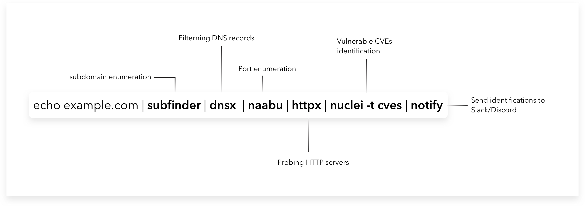
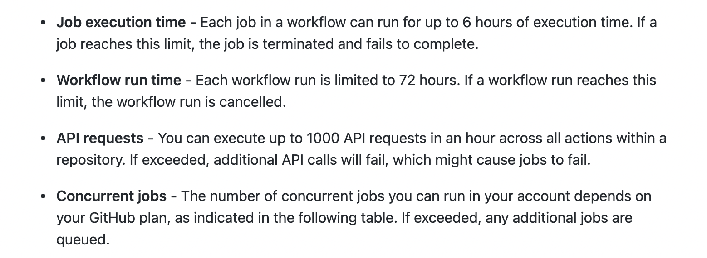

<h1 align="center"> PD Actions </h1>
<h4 align="center">Continuous reconnaissance and vulnerability assessment using <a href='https://github.com/features/actions'>GitHub Actions</a></h4>


<p align="center">
<a href="https://opensource.org/licenses/MIT"></a>
<a href="https://github.com/projectdiscovery/pd-actions/issues"></a>
<a href="https://twitter.com/pdiscoveryio"></a>
<a href="https://discord.gg/projectdiscovery"></a>
</p>

# Advantages

- Free 2000 minutes/month of cloud scans.
- Fully automated and simple to deploy
- Continuous scheduled scans & monitoring of assets
- Integrate any tool of your choice in workflow
- Native git diff support for change visualization

# Setup

- Create a new **private** repository from [here](https://github.com/new) with name `pd-actions`
- Execute below commands, make sure to update `USER_NAME` with your GitHub username.

```bash
▶ git clone --bare https://github.com/projectdiscovery/pd-actions.git; cd pd-actions.git
▶ git push --mirror https://github.com/USER_NAME/pd-actions.git
```

- Update `input/domains.txt` with the target of your interest.
- Make required changes in `.github/workflows/pd-actions.yaml`
- Now you will be able to see the "pd-actions" under Actions tab in your repository. 

For running continuous periodic scan, remove the below comments form your actions file.

```yaml
name: pd-actions

on:
#    schedule:
#      - cron: '0 0 * * *'
    workflow_dispatch:
```

As default, **scans are scheduled to run at 12 AM on daily basis**, you can update schedule and flag values of various tools as per your need in <ins>.github/workflows/pd-actions.yaml</ins> file on your forked version.


<table>
<tr>
<td>

## Config

You can configure keys for sources to use in subfinder in `config/subfinder-config.yaml` to get additional results, also `config/bug-tracker-config.yaml` to make use of nuclei bug reporting module, for [more details](https://nuclei.projectdiscovery.io/nuclei/get-started/#nuclei-reporting).

To send output from any project directly to **Slack, Discord, Telegram**, add/update notify flags in the `.github/workflows/pd-actions.yaml` file accordingly.

</td>
</tr>
</table>

## PD Action workflow



As described in the picture, PD action workflow takes root domain as input from `input/domains.txt` file,
1) Performs passive subdomain enumeration using [SubFinder](https://github.com/projectdiscovery/subfinder)
2) Filter the inactive / invalid subdomains using [dnsx](https://github.com/projectdiscovery/dnsx)
3) Performs port scan for top 100 ports using [Naabu](https://github.com/projectdiscovery/naabu)
4) Run HTTP webserver probing on the discovered ports using [httpx](https://github.com/projectdiscovery/httpx)
5) Run **CVEs based various nuclei templates** using [Nuclei](https://github.com/projectdiscovery/nuclei) 
6) Send alerts to **Slack,Discord,Telegram** using [Notify](https://github.com/projectdiscovery/notify) - (Optional)
7) Create tickets for bugs found using Nuclei on **Github,Gitlab,Jira** - (Optional)

Results from each tool stored in the `output/` directory, upon changes after each scan you can also view the all changes using built in `git diff` UI and CLI.

You can always tweak the flags from each project as per your need directly at `.github/workflows/pd-actions.yaml`.

## Custom workflow

Checkout our blog-post https://blog.projectdiscovery.io/github-actions-for-application-security/ for a detailed breakdown of PD actions workflow and steps to write your own custom workflow using Github actions, PD actions is an idea to showcase utilization of GitHub Actions for Application security automation, you can do a lot of things with your custom workflows and tooling.

We have also added a few [example workflows](https://github.com/projectdiscovery/pd-actions/tree/main/workflows) to run individual projects, we will add more workflows example to cover different use cases to improve security of organization, if you got more workflows example to share with community? please don't hesitate to open a PR :smile:

<table>
<tr>
<td>

### Notes:

- Separate workflow for different organization
	- Helps to avoid hitting 6 hours scan time limit per scan.
	- Managed GitHub change visualization.

- Different schedule time for different workflows.
	- This will avoid running your all scans at same time.

</td>
</tr>
</table>

## Limitations

GitHub free account comes with 2000 minutes/month of free scans, making it practically free to run your continuous scans in the cloud. Few noticeable limits that are worth mentioning are listed below.

<a href='https://docs.github.com/en/actions/reference/usage-limits-billing-and-administration#usage-limits'>  </a>


### Additional reference

- https://docs.github.com/en/actions/reference/usage-limits-billing-and-administration#usage-limits
- https://blog.projectdiscovery.io/github-actions-for-application-security/
- https://cdmana.com/2021/03/20210310142516432Q.html
